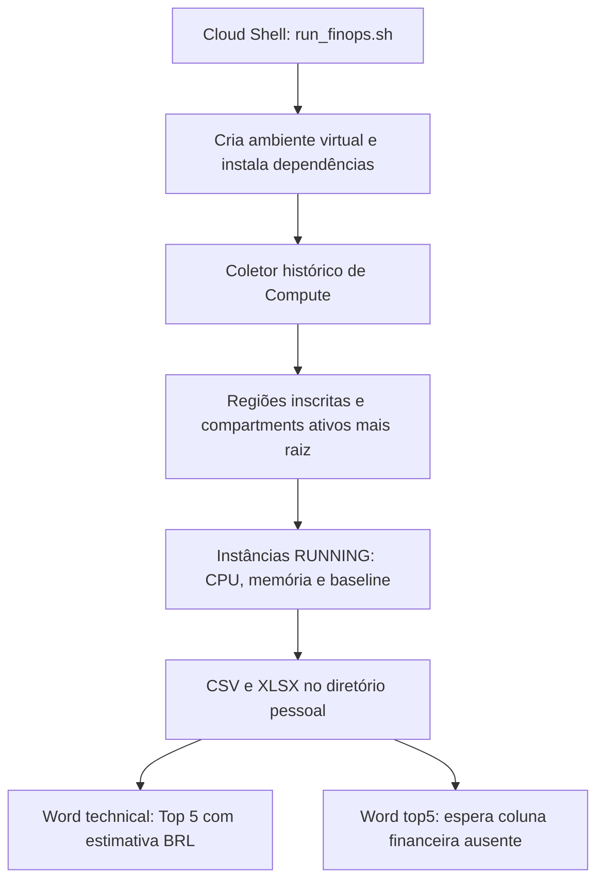

# Análise do projeto e recomendações futuras

Data: 09/09/2026. Escopo: leitura do repositório, entendimento do funcionamento e planejamento. Nenhuma alteração funcional ou operação na tenancy foi executada. As propostas abaixo aguardam a execução real pelo responsável para refinamento.

## 1. Entendimento e direção

O OCI FinOps Analyzer automatiza a coleta e a interpretação de informações da OCI, principalmente de Compute, para produzir relatórios de oportunidades de otimização. O Cloud Shell é o ponto de execução pretendido. Os scripts consultam recursos e métricas e gravam arquivos locais; não executam redimensionamento, desligamento ou exclusão de recursos.

A evolução desejada é consolidar um padrão repetível: inventariar recursos, verificar qualidade das evidências, identificar desperdício ou dimensionamento inadequado, estimar impacto financeiro e apresentar ações revisáveis. Primeiro estabilizar OCI, depois ampliar serviços e, somente após validar a receita, criar outro repositório para AWS.

Já existe uma base útil: descoberta de regiões, paginação de inventários, consultas de métricas, exportação CSV/XLSX/DOCX e inventários auxiliares. Hoje, porém, essa base está distribuída entre scripts independentes com regras e contratos de dados diferentes.

## 2. Fluxo que existe hoje



O comando `bash scripts/run_finops.sh` pressupõe execução na raiz do repositório. Ele executa, nesta ordem:

1. `oci_metrics_cpu_mem_media_ndays.py`.
2. `oci_metrics_cpu_mem_word_technical.py`.
3. `oci_metrics_cpu_mem_word_top5.py`.

O caminho manual do README/QUICKSTART usa o mesmo coletor, mas depois chama `oci_metrics_cpu_mem_word_report.py`, que produz um conteúdo financeiro diferente, em USD. Os dois geradores `word_report` e `word_technical` gravam no mesmo nome de DOCX e podem sobrescrever um ao outro.

O coletor principal usa `METRICS_DAYS`, com padrão de 30 dias, e consultas `CpuUtilization[5m]...mean()` e `MemoryUtilization[5m]...mean()` no namespace `oci_computeagent`. Calcula média e P95 localmente sobre os pontos agregados retornados. Não preserva as séries temporais nos arquivos finais.

### Inventário dos scripts

| Arquivo em `src/` | Papel observado |
|---|---|
| `oci_metrics_cpu_mem_media_ndays.py` | Coletor principal; CSV/XLSX, OCID, configuração burstable e recomendações de Compute. |
| `oci_metrics_cpu_mem_word_technical.py` | Calcula estimativas BRL internamente e apresenta Top 5; apesar do nome, o conteúdo é predominantemente executivo. |
| `oci_metrics_cpu_mem_word_top5.py` | Gera rankings de economia e aumento a partir de `monthly_savings_brl`. |
| `oci_metrics_cpu_mem_word_report.py` | Documento detalhado de redução/aumento com preços fixos simplificados em USD. |
| `oci_finops_cpu_mem_collect.py` | Coletor alternativo com regras mais curtas; gera `Relatorio_FinOps_CPU_MEM_*`. |
| `oci_finops_word_downsize_strong.py` | Consome o CSV desse coletor alternativo; estima redução de 50% em USD. |
| `oci_cpu_mem_report.py` | Outro coletor CPU/memória, com nomes de saída próprios; não é apenas formatador. |
| `oci_burstable_report.py` | Inventário separado de baseline; usa acesso ao atributo diferente do coletor principal. |
| `oci_metrics_cpu_mem_realtime.py` | Consulta últimos 30 minutos e imprime o último ponto retornado; não é monitoramento contínuo e não adiciona o compartment raiz. |
| `inventarioStartStop.py` | Inventário de instâncias, estado e tags em CSV/XLSX; não executa Start/Stop. |
| `organiza_tags_csv.py` | Expande freeform tags e apenas o namespace definido `Oracle-Tags`. |
| `relatorio_finops_tags_from_csv.py` | Classifica instâncias em execução sem tag reconhecida de AutoStop como `RISK`. |
| `logs.py` | Inventaria configuração de logs e classifica por tipo, estado e serviço; não mede ingestão ou custo. |
| `Untitled.py` | Variante com CLI, logging, P95 interpolado e sugestão de aumento de OCPU; não está integrada ao fluxo principal. |

Tags, Start/Stop e logs são fluxos separados: não são chamados por `run_finops.sh`.

## 3. Pontos prioritários confirmados no código

### P0 — Confiabilidade das recomendações

**Dados ausentes são interpretados como zero.** Em `oci_metrics_cpu_mem_media_ndays.py`, função `finops`, todos os valores passam por `valor or 0`. Uma instância sem CPU e memória recebe `DOWNSIZE-STRONG`. A ausência de telemetria precisa virar `INSUFFICIENT_DATA`, com motivo e cobertura, e não oportunidade financeira. O padrão se repete nos coletores alternativos e em cálculos dos documentos.

**Redução tem precedência sobre saturação.** A função retorna recomendações de redução antes de verificar P95 alto. Foram reproduzidos localmente, sem importar OCI ou acessar a nuvem:

| CPU média/P95 | Memória média/P95 | Retorno atual |
|---|---|---|
| Ausente/ausente | Ausente/ausente | `DOWNSIZE-STRONG` |
| 90% / 99% | 20% / 30% | `DOWNSIZE-MEM` |
| 4% / 90% | 20% / 95% | `DOWNSIZE-STRONG` |

Proposta: avaliar qualidade primeiro, depois saturação e restrições por dimensão. CPU e memória podem exigir ações diferentes. Um pico alto também não deve automaticamente obrigar upscale: é necessário avaliar duração, recorrência e impacto no serviço.

**O dimensionamento sugerido não acompanha a dimensão do problema.** Os geradores Word reduzem CPU e memória juntos por um fator de 0,5 ou 0,25, inclusive para `DOWNSIZE-MEM`. Isso pode reduzir CPU em uma instância já saturada. Devem calcular alvos independentes e verificar compatibilidade, mínimos, incrementos e limites da shape, incluindo a diferença entre shapes fixas e Flex.

**O Top 5 do pipeline não recebe os valores de que precisa.** `get_top5` em `oci_metrics_cpu_mem_word_top5.py` lê `monthly_savings_brl`; o coletor principal não produz essa coluna. O valor padrão é zero, e as linhas são descartadas. O Word técnico calcula economia em memória, mas não atualiza o CSV. Assim, o Top 5 separado pode sair com títulos e sem oportunidades mesmo quando existem reduções no CSV.

Proposta: calcular o impacto financeiro uma vez, persistir no resultado canônico e fazer todos os relatórios consumirem esse resultado. Separar `estimated_savings_monthly` de `estimated_extra_cost_monthly`, com moeda explícita, evitando ambiguidade de sinal no upscale.

### P1 — Métricas, cobertura e execução

| Evidência | Consequência | Recomendação futura |
|---|---|---|
| P95 calculado por `int(n * 0.95) - 1` nos coletores principais. Para `[0, 100]`, retorna 0. `Untitled.py` já usa interpolação. | Resultados divergentes, especialmente com poucas amostras. | Definir uma convenção estatística, centralizar e testar amostras pequenas. |
| P95 é calculado sobre médias de 5 minutos. | Picos dentro desses intervalos podem ser diluídos. | Identificar a agregação no relatório; acrescentar máximos e duração acima de limiares conforme necessidade. |
| Não há contagem esperada/recebida, cobertura ou horários efetivos no resultado. | Uma janela incompleta pode parecer uma análise integral. | Salvar início/fim UTC, resolução, quantidade de pontos, lacunas e confiança por métrica. |
| `get_metric` usa apenas `resp.data[0]`. | Outras séries, quando retornadas, ficam fora da análise. | Verificar dimensões e cardinalidade; consolidar somente séries semanticamente compatíveis. |
| Principal analisa apenas instâncias atualmente `RUNNING`. | Recursos parados e custos associados não entram nessa análise. | Manter inventário abrangente e separar estado atual de histórico de utilização. |
| Erros de listagem podem ser ignorados com `continue`. | Relatório parcial pode parecer completo. | Registrar falhas por região/compartment/recurso e publicar status `complete`, `partial` ou `failed`. |
| Falhas em métricas ou `get_instance` podem encerrar a coleta principal. | Perda de progresso e ausência de exportação. | Isolar falhas por recurso, salvar progresso e retomar com identificação da execução. |
| Vários scripts acessam `rows[0]` sem verificar lista vazia. | Exceção em tenancy vazia, escopo sem recursos ou coleta sem acesso. | Emitir resultado vazio válido com causa distinguível de falha. |
| Repetição explícita do principal trata apenas 429, com espera fixa. | Recuperação limitada sob limitação de chamadas. | Revisar política do SDK e configurar retentativas limitadas com espera progressiva e jitter, sem duplicar mecanismos. |
| Configuração usa `oci.config.from_file()` sem seleção explícita de profile ou signer. | O uso documentado de `OCI_CLI_PROFILE` não está implementado explicitamente no projeto. | Centralizar autenticação e validar o modo efetivo no Cloud Shell; expor profile e arquivo de configuração. |
| Saídas têm nomes fixos no diretório pessoal. | Execuções e tenancies podem sobrescrever resultados; um CSV antigo pode ser reutilizado se uma nova coleta não gerar linhas. | Diretório por execução, tenancy e data; manifesto relacionando insumos e relatórios. |
| Dependências sem versões e instalação em toda execução do shell script. | O ambiente não é reproduzível. | Separar instalação de execução e registrar versões validadas e versão do projeto. |

O guia sugere 90 dias, mas os coletores principais fixam `5m` sem resolução explícita. A Oracle documenta alcance máximo de 30 dias para resolução de 5 minutos e 90 dias para 1 hora. É necessário validar a janela e informar a granularidade real; simplesmente dividir consultas antigas em lotes não contorna o alcance relativo ao momento atual. [Oracle: resolução de consultas](https://docs.oracle.com/en-us/iaas/Content/Monitoring/Tasks/query-metric-resolution.htm).

O Cloud Shell é adequado à execução interativa. A Oracle documenta sessões limitadas a 24 horas, encerramento por inatividade e restrições de rede. Portanto, os exemplos de cron não devem ser tratados como garantia de execução mensal no Cloud Shell. Uma futura rotina desassistida deve ter executor persistente ou serviço apropriado, além de validação de conectividade multirregião. [Oracle: Cloud Shell](https://docs.oracle.com/en-us/iaas/Content/API/Concepts/cloudshellintro.htm).

### P1 — Finanças e burstable

- O README descreve BRL e `PRICE_MATRIX` em `word_report`, mas esse arquivo usa constantes USD. A matriz BRL existe em `word_technical`.
- A matriz não registra data, origem verificável por SKU, condições comerciais ou conversão. Shapes desconhecidas assumem E4 silenciosamente.
- As estimativas pressupõem 730 horas mensais e não incorporam o conjunto de componentes cobrados, contratos e licenças. Devem ser apresentadas como cenários, com premissas e itens excluídos.
- `parse_baseline` do coletor principal consulta `shape_config`; o script burstable consulta diretamente a instância. Unificar o acesso e validar baseline integral: o principal classifica qualquer baseline presente, inclusive `BASELINE_1_1`, como `YES`.
- O coletor principal não retorna recomendações `BURSTABLE-*`, embora a documentação as anuncie e `word_technical` tenha uma ramificação para elas.
- Elegibilidade e economia burstable precisam considerar shape suportada, padrão de carga, duração dos picos e baseline existente. As limitações de burst impedem inferir adequação somente pela média baixa. [Oracle: Burstable Instances](https://docs.oracle.com/en-us/iaas/Content/Compute/References/burstable-instances.htm).
- O título “Baixo Risco” do Top 5 não é sustentado por avaliação de criticidade, dependências ou confiança dos dados. Ranking financeiro e risco operacional devem ser campos separados.
- Ao oferecer downsize, burstable e agendamento para a mesma VM, apresentar cenários alternativos ou calcular combinações explicitamente para não somar economias incompatíveis.

### P2 — Tags, logs, documentação e exemplos

**Tags:** os exemplos têm `Enviroment`, `Schedule_start`, `Schedule_stop` e variantes em minúsculas. O analisador procura `Environment`/`Env` e `AutoStop`/`autostop`/`Schedule`, aceitando somente valores booleanos específicos. Assim, horários existentes podem não ser reconhecidos. Criar normalização configurável, abranger todos os namespaces de defined tags e distinguir “tag ausente”, “agenda declarada” e “automação verificada”. Uma tag não comprova que o desligamento ocorreu; produção 24x7 pode legitimamente não ter agenda.

**Logs:** `logs.py` recomenda `REMOVE` para qualquer estado diferente de `ACTIVE`, sem verificar estado transitório, retenção, ingestão ou dependência. Evoluir para oportunidades justificadas por volume, retenção e necessidade operacional, usando `REVIEW` quando faltarem evidências. O script atual não remove nada.

**Documentação:** alinhar os limites com o código real (CPU 5/15/80 e memória 40/85 no principal), nomes de arquivos, moedas e scripts. Exemplos de constantes no README não correspondem à implementação. Os documentos em `docs/` são esboços muito curtos. Os “casos de sucesso” do QUICKSTART não têm evidência associada no repositório e devem ser identificados como ilustrativos ou documentados.

**Exemplos:** foram inspecionados o CSV e os conteúdos XML dos arquivos Office válidos. Há 80 linhas de dados de Compute, 79 de logs e 88 em cada planilha de inventário/tags/StartStop. O Word contém estimativas USD. `sample_output.xlsx` tem zero bytes; `sample_output.csv` possui apenas quatro colunas, insuficientes para os geradores Word. Alguns exemplos contêm OCIDs e metadados de ambiente: preparar dados sintéticos coerentes antes de usá-los como modelo público, sem presumir que identificadores sejam credenciais.

**Organização:** consolidar duplicações, definir o destino de `Untitled.py`, preservar compatibilidade durante a transição e criar um guia único de execução. O `.gitignore` ignora qualquer CSV, mas não relatórios XLSX/DOCX; preferir uma pasta explícita de resultados e permitir fixtures sintéticas versionadas.

## 4. Estrutura recomendada para virar padrão

Proposta de separação, a implementar gradualmente:

```text
CLI e configuração
  -> autenticação e descoberta do escopo
  -> coletores por serviço
  -> normalização e qualidade de dados
  -> regras de oportunidade e restrições
  -> estimativa financeira
  -> resultados versionados
  -> CSV / Excel / Word
```

Cada coletor deve devolver inventário, métricas e status de coleta. Regras devem ser funções testáveis sem autenticação. Geradores de documentos devem apenas apresentar resultados, evitando recalcular custos ou decidir dimensionamento.

O registro comum deve incluir provedor, tenancy/conta, região, serviço, ID estável do recurso, nome, compartment, tags, estado, configuração atual, janela observada, unidades, cobertura, regra e versão, evidências, ação proposta, restrições, confiança, custo atual/alvo, economia ou aumento, moeda, origem/data do preço e identificador da execução. Nem todo recurso tem CPU ou memória; campos específicos ficam no módulo do serviço.

Configuração deve permitir seleção de serviços, regiões, compartments, tags, exclusões justificadas, dias, granularidade, limiares e destino dos relatórios. Começar com arquivo de configuração e CLI simples. Preservar operação de leitura como padrão; aplicação de mudanças é uma etapa operacional futura distinta.

## 5. Expansão OCI proposta

Estas são hipóteses de módulos e critérios a detalhar com os serviços efetivamente usados. Não são funcionalidades já implementadas nem decisões de remoção.

| Módulo | Oportunidades a investigar | Evidências e condições necessárias |
|---|---|---|
| Compute | Rightsizing, ociosidade, burstable e agenda fora do expediente. | CPU/memória, picos, rede/disco, cobertura, estado, shape, criticidade, dono e horários. |
| Block/Boot Volumes e backups | Volumes sem vínculo, desempenho provisionado excessivo e retenção redundante. | Anexos, idade, IOPS/throughput, capacidade, política de backup e necessidade de recuperação. |
| Object Storage / buckets | Classe de armazenamento inadequada ao acesso, versões antigas, multipart incompleto e ausência de lifecycle. | Tamanho por tier, requisições, objetos, versionamento, retenção, lifecycle e custo de acesso/recuperação. |
| Bancos de dados | Capacidade provisionada excessiva, ambientes não produtivos ociosos, storage e backups acima da necessidade. | Separar Autonomous, Base Database, Exadata e outros usados; avaliar unidade de capacidade, CPU, sessões, I/O, latência, crescimento, HA/DR, licenças e validação do DBA. |
| Load Balancer | Capacidade acima do tráfego ou configuração aparentemente sem uso. | Tráfego, conexões, backends, saúde, dependências e sazonalidade. |
| OKE | Nós ociosos e diferença entre requests/limits e consumo. | Dados de cluster/workload além das VMs, autoscaling, capacidade de reserva e disponibilidade. |
| Logging | Ingestão/retencão excessiva e coleta redundante. | Bytes ingeridos, prazo exigido, origem e uso operacional; revisar a regra atual por nome de serviço. |
| Rede e demais serviços | Transferência cara e recursos candidatos à revisão por falta de uso. | Cobrança efetiva, vínculos, tráfego, topologia e criticidade; selecionar serviços pelo peso na fatura. |

Para buckets, `oci_objectstorage` oferece métricas como `StoredBytes`, `ObjectCount`, `GetRequests` e `UncommittedParts`. Buckets vazios não emitem métricas: o inventário será indispensável para distinguir vazio de ausência de observação. Começar por metadados e métricas agregadas, deixando varredura de objetos para necessidade comprovada. [Oracle: Object Storage Metrics](https://docs.oracle.com/en-us/iaas/Content/Object/Reference/objectstoragemetrics.htm).

Baixo uso não prova abandono: buckets de recuperação, bancos de contingência e volumes de restauração podem estar corretamente reservados. Cada módulo deve classificar “candidato a revisão” com evidência e dono, sem converter ausência de atividade automaticamente em exclusão.

## 6. Sequência sugerida e critérios de conclusão

| Etapa | Entrega | Critério para avançar |
|---|---|---|
| 1. Execução de referência | Resultado do Cloud Shell e lista de falhas reproduzíveis. | Saber quais scripts rodaram, versões, escopo esperado/obtido e arquivos realmente gerados. |
| 2. Correção de Compute | Tratar ausência de dados, precedência das regras, P95, Top 5, moedas e baseline. | Casos representativos com resultados explicáveis; relatórios concordam com o CSV. |
| 3. Padronização | Coleta, regras, custos e apresentação separados; configuração e manifesto. | Uma execução reproduzível, falha parcial visível e relatórios regeneráveis offline. |
| 4. Expansão OCI | Buckets/volumes e primeiro tipo de banco prioritário. | Cada módulo tem inventário, evidência, regras, restrições e exemplos validados. |
| 5. Operação contínua | Histórico e acompanhamento das oportunidades. | Distinguir economia estimada, ação aprovada, ação aplicada e economia observada. |
| 6. Receita AWS | Novo repositório derivado do padrão estável. | Reutilizar contratos e relatórios mantendo regras, unidades e preços específicos do provedor. |

Os testes futuros mais valiosos cobrem ausência/parcialidade de métricas, conflito entre CPU e memória, amostras pequenas, paginação, erros por recurso, listas vazias, baseline integral, shape sem preço, tags variantes e contrato coletor→relatórios. Uma integração offline com dados sintéticos deve confirmar que o Top 5 apresenta os mesmos valores do resultado canônico. Não há suíte de testes nem CI versionadas atualmente.

## 7. Como reaproveitar na AWS depois

A receita reutilizável será o processo e o contrato de dados: inventário → evidência → regra → custo → recomendação → acompanhamento. No novo repositório, autenticação, descoberta, coleta de métricas, catálogo de recursos e cálculo de custos devem ser adaptados à AWS.

Como organização inicial de backlog, avaliar Compute/EC2, buckets/S3, volumes/EBS e bancos/RDS/Aurora, sem assumir equivalência de regras ou cobrança. Não copiar limiares e cálculo OCPU para vCPU mecanicamente; burstable, licenças, descontos e métricas requerem validação própria. Evitar extrair uma biblioteca multicloud prematuramente: primeiro estabilizar os contratos na OCI e só compartilhar o que o segundo projeto comprovar ser comum.

## 8. O que registrar na execução que você vai trazer

- Comando executado, commit e versões de Python/SDK.
- Período solicitado e tempo total de execução.
- Regiões/compartments e quantidade aproximada de recursos esperados.
- Mensagens de erro e indicação do ponto em que ocorreram.
- CSV/XLSX/DOCX produzidos, distinguindo saídas novas de arquivos anteriores.
- Alguns casos conhecidos: VM ociosa, VM com pico, VM sem memória reportada, burstable e ambiente com agenda.
- Diferenças entre o que aparece no Console e o que aparece no relatório, usando a mesma janela e agregação.

Essas evidências permitirão priorizar correções reais e ajustar as regras à operação antes de aumentar a cobertura.

## 9. Limites desta revisão

Foram lidos os 14 scripts Python, shell script, dependências, arquivos Markdown, licença, `.gitignore` e exemplos versionados. A sintaxe dos 14 scripts foi verificada com o parser local do Python 3.14.7. As regras citadas foram exercitadas isoladamente a partir da AST, sem executar inicialização do SDK. Os arquivos Office válidos foram inspecionados por conteúdo e estrutura XML; não houve avaliação visual no Word/Excel.

Não foram testados autenticação, permissões, resposta das APIs, custo contratual ou execução ponta a ponta na OCI. Compatibilidade com a versão mínima anunciada de Python também não foi comprovada. As referências Oracle sustentam os pontos externos sobre Monitoring, Cloud Shell, burstable e buckets; os demais achados descrevem o código local e propostas de arquitetura.
